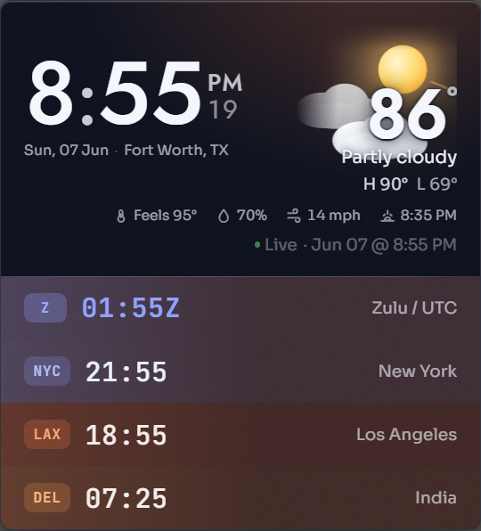

# Chrona

A frameless desktop **clock + live-weather glass widget** for Windows. A large
tabular clock, a living animated weather scene, and a stack of world clocks —
each tinted by the time of day in its own zone — floating on your desktop as a
translucent Mica/Acrylic card.

<p align="center">
  
</p>

## Features

- **Clock** — 12/24-hour, optional seconds, AM/PM, crisp tabular figures.
- **Live weather** — a living scene that animates the current conditions (sun,
  moon, clouds, rain, snow, fog, thunderstorms, and severe modes like wind,
  tornado, flood, and blizzard), with temperature, hi/lo, and a row of readouts
  (feels-like, humidity, wind, sunrise/sunset).
- **Adaptive look** — the glass tint and accent shift with the time of day
  (dawn → midday → golden hour → night), nudged by the weather.
- **World clocks** — up to 5 time zones; each row glows in the accent of *its
  own* local time of day.
- **Glass materials** — Mica (blurred wallpaper), Acrylic (blurred apps behind),
  or a plain adjustable-radius Glass, plus light / dark / auto themes.
- **Yours to arrange** — drag to move, resize from the corner, pin in place,
  keep on top, and run at startup. It remembers where you put it.
- **Stays current** — updates itself automatically; no telemetry.

## Install

1. Go to the [**Releases**](https://github.com/qBitnaut/chrona/releases/latest) page.
2. Download **`Chrona_x.y.z_x64-setup.exe`** (recommended) — or the `.msi` if you
   prefer / deploy at scale — and run it.
3. Launch **Chrona**. It appears as a floating widget on your desktop.

> **Windows 10:** install the free [WebView2 runtime](https://developer.microsoft.com/microsoft-edge/webview2/)
> if it isn't already present. Windows 11 has it built in. Mica needs Windows 11;
> on Windows 10 the glass falls back to Acrylic automatically.

Chrona keeps itself up to date — when a new version is released it downloads and
installs in the background, so you won't need to reinstall.

## Using Chrona

- **Move it** — drag the card anywhere (unless it's pinned).
- **Resize it** — drag the bottom-right corner; it scales proportionally.
- **Right-click** for the menu: Pin to desktop, Settings, Run at startup, Always
  on top, Reset position, Quit.
- **System tray icon** — left-click to show/hide; right-click for the same menu.
- **Settings** (right-click → Settings…) let you change the theme, fonts, size,
  glass material and blur, clock format, your location and units, which weather
  readouts to show, and your world-clock zones.

### Location & weather

By default Chrona shows weather for a city you set in Settings — search for it
and pick the exact match. You can also let it detect your approximate location
by IP. Weather comes from the US National Weather Service (with official severe
alerts) and Open-Meteo elsewhere; if you're ever offline it shows clearly-marked
sample data.

## Building from source

Chrona is built with [Tauri 2](https://tauri.app) (Rust) and a bundled
React/Canvas frontend.

```powershell
pnpm install
pnpm tauri dev      # run locally
pnpm tauri build    # build installers
```

See **[docs/DEVELOPMENT.md](docs/DEVELOPMENT.md)** for prerequisites,
architecture, the release pipeline, and updater/signing setup.
